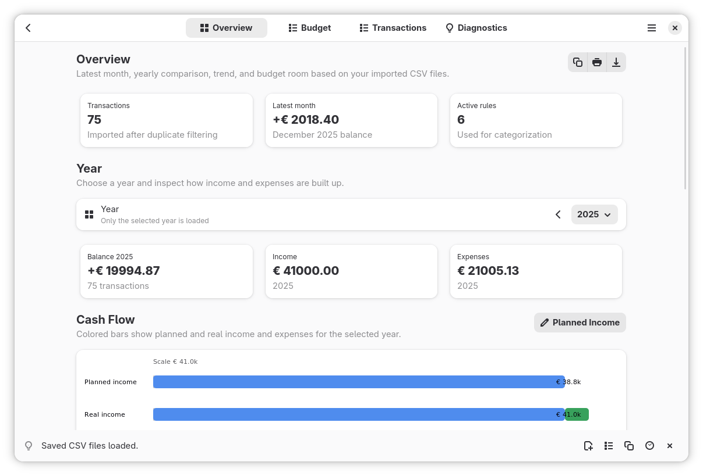

[](https://github.com/noobping/bank-files/actions/workflows/win.yml)
[](https://github.com/noobping/bank-files/releases/latest/download/bank-files.msi)

# Bank Files

A local GTK app for testing money decisions against your real bank-file history. Add temporary fake transactions to see what happens if you buy something, take on a new cost, receive salary, or solve a problem with the money you have.

Bank Files can also be used as a simple bank-file viewer. It opens CSV, Excel, and Calc bank files locally, keeps remembered history so older imports are not lost, and lets you turn that off when you only want to inspect files for the current session.

Duplicate filtering keeps repeated downloads from changing results, so you can import bank exports whenever you feel like it. The app keeps the overview easy and warns you when spending, budgets, or missing rules need attention.



## Features

- Add fake transactions to preview purchases, salary changes, refunds, transfers, recurring costs, and other what-if choices without editing the original bank files.
- Open bank transaction CSV, Excel, and Calc files through **Choose Bank Files**, drag-and-drop, **Open With**, or the app data folder.
- Remember opened bank files so history stays available across sessions, or use forget mode as a temporary viewer.
- Filter duplicate rows so bank exports downloaded at random moments do not distort totals.
- Automatic field detection for columns such as date, amount, description, counterparty, account, currency, transaction ID, debit, and credit.
- Open configuration CSVs the same way: `rules.csv`, `budgetcodes.csv`, and `field_aliases.csv`.
- Detect common bank fields such as date, amount, debit, credit, description, counterparty, tags, account, currency, direction, and transaction ID.
- Read common delimiters: `;`, `,`, tab, and `|`.
- Parse European amount notation such as `1.234,56` and international notation such as `1,234.56`.
- Categorize income and expenses with editable rules, regex patterns, amount limits, directions, and tags.
- Use fixed monthly budgets or percentage-based budgets such as `10%` / `10% of income`.
- Show monthly and yearly overviews, trends, category changes, budget room, and transaction lists.
- Warn when spending is above income or planned budgets exceed income; over-budget items stay visible on budget cards. Transfers use `direction=transfer` so internal money moves do not inflate income or expenses.
- Filter cards and charts into the transaction list, then copy, print, or export the filtered result.
- Print filtered reports and export cleaned transactions as CSV.
- Generate an initial budget from imported transactions when the default budgets are still in use.
- Restore the default budgeting files when custom generated budgets are no longer wanted.

## Install on Debian/Ubuntu

```bash
sudo apt update
sudo apt install build-essential pkg-config libgtk-4-dev libadwaita-1-dev
```

Install Rust through rustup if it is not installed yet.

```bash
cargo run --release
```

## Install on Fedora

```bash
sudo dnf install gcc pkg-config gtk4-devel libadwaita-devel
cargo run --release
```

## Linux Install From Source

Use Meson for a normal Linux install. This installs the binary, desktop file, app metadata, GSettings schema, icons, symbolic action icons, GTK resource bundle, GNOME search provider files, compiled translations, and source PO/POT files in the selected prefix. For a Meson release build, the default feature set is enough:

```bash
meson setup build -Dcargo_variant=release
meson compile -C build
sudo meson install -C build
```

The GTK resource bundle is installed to `share/bank-files/bank-files.gresource` and loaded from there by normal Linux release installs. Plain Cargo development builds, Meson developer/debug builds, Windows builds, and setup/self-contained builds keep GTK resources embedded:

```bash
meson setup build -Dcargo_variant=release -Dsetup=true
```

## Usage

1. Start the app with `cargo run --release`.
2. Click **Choose Bank Files**, drop bank CSV, Excel, or Calc files onto the window, use **Open With**, or place transaction files manually in the app data folder.
3. Open `rules.csv`, `budgetcodes.csv`, or `field_aliases.csv` the same way to update configuration.
4. Use **Categorization Rules**, **Budgets**, and **Normalize CSV Fields** to edit configuration inside the app.
5. Add fake transactions from the main menu or from an existing transaction to preview what changes.
6. Use Overview and Budget cards and charts to jump to matching transactions.
7. Use **Print Page** or **Export CSV** to share the current filtered view.

## Main pages

- **Overview** shows imported totals, fake-transaction effects, the latest month, active rules, yearly comparisons, trend charts, budget warnings, and annual categories.
- **Budget** shows one selected month with expenses, income, balance, budget room, category totals, fake-transaction effects, and budget warnings.
- **Transactions** shows the searchable transaction list. Click a transaction to expand CSV-like details such as source file, tags, account, and transaction ID.
- **Diagnostics** shows import quality, detected fields, warnings, duplicate filtering, and quick actions for rules and field mappings.

## Warnings and attention signals

The app highlights several situations that are easy to miss in a bank export:

- **Spending is above income**: expenses exceed income for the selected month or year.
- **Check your budget**: planned budgets are above income.
- **Spending is over budget**: one or more budget codes are over plan, including spending without a configured budget.
- **Unconfigured budgets**: expense transactions have a missing or unknown budget code.
- **Other categories**: transactions fall back to `OTHER` or `INC-OTHER`.

## Bundled CSV examples

The repository includes English, Dutch, and German sample CSVs:

- transaction demos: `data/example/demo_transactions.en.csv`, `data/example/demo_transactions.nl.csv`, `data/example/demo_transactions.de.csv`, and `data/example/demo_transactions.csv`
- default English configuration: `data/defaults/editable_rules.csv`, `data/defaults/budgetcodes.csv`, and `data/defaults/editable_field_aliases.csv`
- default Dutch configuration: `data/defaults/editable_rules.nl.csv`, `data/defaults/budgetcodes.nl.csv`, and `data/defaults/editable_field_aliases.nl.csv`
- default German configuration: `data/defaults/editable_rules.de.csv`, `data/defaults/budgetcodes.de.csv`, and `data/defaults/editable_field_aliases.de.csv`

On first start, missing configuration files are created in the app configuration folder. Dutch and German environments receive localized defaults; other environments receive the English defaults. Existing configuration files are left unchanged.

## Custom categorization rules

Rules live in `rules.csv` in the configuration folder. Open the rules editor from **Categorization Rules**.

Columns:

```csv
priority,active,field,pattern,category,budget_code,direction,amount_min,amount_max,notes
```

Example:

```csv
120,true,any,"(?i)github|openai|hetzner",Software & cloud,CLOUD,expense,,,Work/developer tools
```

Important fields:

- `priority`: highest priority wins.
- `active`: `true` or `false`.
- `field`: `any`, `description`, `counterparty`, `tags`, `account`, or `transaction_id`.
- `pattern`: regex; use `(?i)` for case-insensitive matching.
- `direction`: `expense`, `income`, or empty for all transactions.
- `amount_min` and `amount_max`: optional, based on absolute transaction value.
- `category` and `budget_code`: the values assigned when the rule matches.

Rules can also be created from a transaction detail menu.

## Budget codes

Budget codes live in `budgetcodes.csv` in the configuration folder and can be edited from **Budgets**.

```csv
code,parent_code,special,category,monthly_budget,yearly_budget,direction,income_basis,notes
FOOD,,,Groceries,500,,expense,real,Monthly groceries budget
CARE,,,Healthcare,,1200,expense,real,Annual healthcare budget
MEDS,CARE,,Medication,50,,expense,real,Medication sub budget
```

The `monthly_budget` and `yearly_budget` fields accept fixed amounts and income-based percentages:

```csv
FOOD,,,Groceries,500,,expense,real,Monthly groceries budget
CARE,,,Healthcare,,1200,expense,real,Yearly healthcare budget
SAVE,,,Savings,10%,,income,real,Monthly savings target
```

Actual expenses are compared with the configured budget. Monthly views use `monthly_budget`; if it is empty they show one twelfth of `yearly_budget`. Yearly views use `yearly_budget`; if it is empty they annualize `monthly_budget`. If both are set, each view uses its matching period. Warnings are shown when spending or planning exceeds income.

Use `parent_code` to make sub budget codes. A child is still a normal budget code, and parent budget rows include their own totals plus all child budget totals.

## Field aliases

If a bank uses an unusual column name, add it to `field_aliases.csv` in the configuration folder or use **Normalize CSV Fields** / Diagnostics field mapping.

```csv
canonical,alias
amount,Transaction amount in EUR
description,Details betaling
tags,Rubriek
```

Canonical names:

- `date`
- `amount`
- `debit`
- `credit`
- `description`
- `counterparty`
- `tags`
- `account`
- `transaction_id`
- `currency`
- `direction`

## Data location

By default, the app uses platform folders from `dirs-next`:

- configuration: `config_dir()/bank-files`, for example `~/.config/bank-files` on Linux
- app data and transaction CSVs: `data_dir()/bank-files`, for example `~/.local/share/bank-files` on Linux

You can set a fixed or project-local location with:

```bash
BANK_FILES_HOME=/path/to/my/bank-files cargo run --release
```

With `BANK_FILES_HOME`, `config/` is used for rules and `data/` for transaction CSVs under that folder.

## Privacy

Everything runs locally. Bank data is not sent to external services.

## Field detection limits

Banks use different CSV formats. The heuristic usually works well with clear column names and normal amount notation. For unusual exports, use the **Diagnostics** page to see which fields were detected, then add field aliases or map a CSV header.
